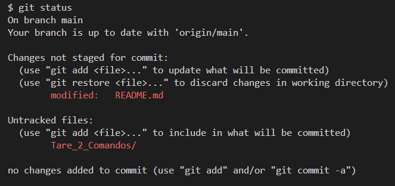
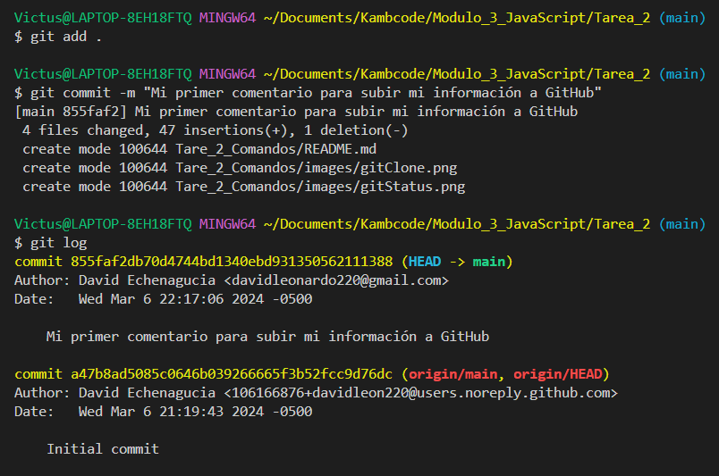
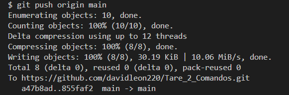

# Tare_2_Comandos

## Para subir la información a GitHub.
> - 1) Hay que abrir *Git Bash*
> - 2) Hay que escribir el comando *git status* para ver el estatus de los archivos.

> - 3) Luego escribir el comando *git add .* para agregrar los cambios.
> - 4) Luego hacer un comentario con el comando *git commit -m "Agregar el  comentrio"*
> - 5) *git log* sirve para ver los comentarios que se han hecho.

> - 6) Luego ingresar el comando *git push origin master* o *git push origin main* para subir todo a GitHub.

### Para crear una Rama

> - 1) Escribir el comando *git checkout -b rama_nueva*
> - 2) Para cambiar de rama escribir este comando *git checkout rama_nueva*
> - 3) PAra cambiar de rama hay que usar el siguiente comando: desde la rama  rama_nueva ingresar el comando *git checkout main/master* o al contrario.

### Para hacer merge

> - 1) Recuerda ya haber agregados los cambios con *git add .*  y hacer el commit con *git commit -m "Nuevo comentario"*
> - 2) Desde la rama main/master ingresar el siguiente comando *git merge nueva-rama*

